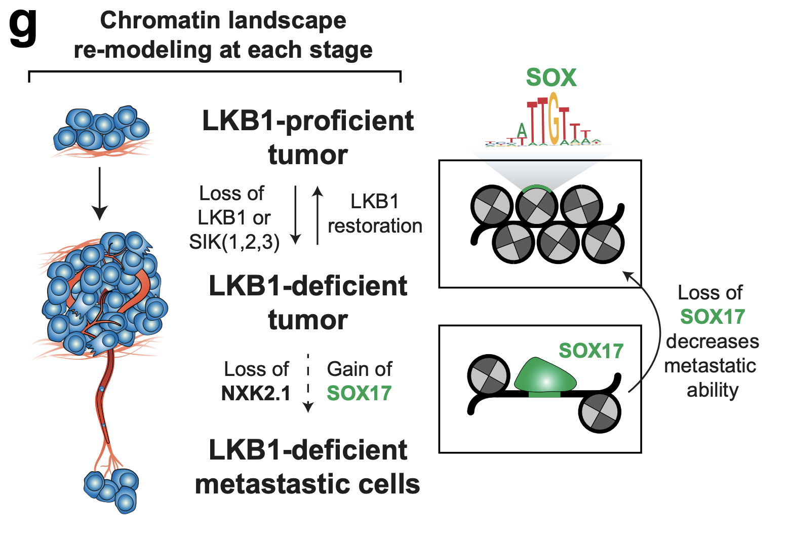

# LKB1 inactivation modulates chromatin accessibility to drive metastatic progression (Pierce SE*, Granja JM*, et al. 2021)

## **Link** : https://www.biorxiv.org/content/10.1101/2021.03.29.437560v1

## Please cite : Pierce SE et al., LKB1 inactivation modulates chromatin accessibility to drive metastatic progression. bioRxiv (2021)  

###  Analysis Scripts

Correlation-Analysis-ATAC.R - Example Analysis of Correlation Heatmap of peaks ATAC-Seq.

Differential-Analysis-ATAC.R - Example Analysis of Differential peaks ATAC-Seq.

Heatmap-Analysis-ATAC.R - Example Analysis of Heatmap variable peaks ATAC-Seq.

PCA-Analysis-ATAC.R - Example Analysis of PCA variable peaks ATAC-Seq.

Compare-Differential-Deviations.R - - Example Analysis of comparing differential chromVAR deviations ATAC-seq.

scATAC-Analysis-ArchR.R - scATAC Analysis of LKB1 mouse tumor data.
